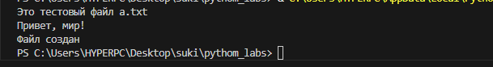
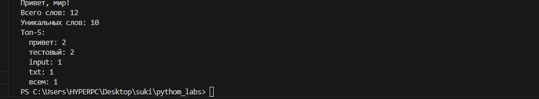
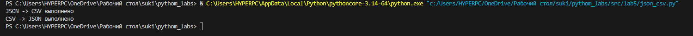
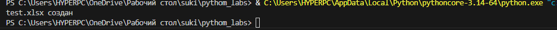

# pythom_labsgit
### лаба 1

### задание 1
```bash
name = input("Имя : ")
aage = int(input("Возраст : "))
print("Привет",name,"!", "Через год тебе будет", aage + 1, "." )
```


## задание 2
```bash
first = input()
sec = input()
first = float(first.replace(",","."))
sec = float(sec.replace(",","."))
print(round(first + sec,2), round((first + sec)/2,2))
```


## задание 3
```bash
price = int(input())
sasale = int(input())
vshevstvennie = int(input())
base = price * (1 - sasale / 100)
hz = base * (vshevstvennie / 100)
itog = base + hz
print("База после скидки: ", base)
print("НДС: ", hz)
print("Итог к оплате: ", itog)
```


## задание 4
```bash
minets = int(input("Minuti : "))
howers = minets // 60
print(f"{howers}:{minets % 60}")
```


## задание 5
```bash
familia,ima,otchestwo = input("ФИО : ").split()
iniciala = familia[0] + ima[0] + otchestwo[0]
dlina = len(familia) + len(ima) + len(otchestwo)
print("Инициалы : ", iniciala)
print("Длина : ", dlina + 2) # два потому что у нас три слова и между ними может быть только два пробела не лишних, тк я считал  сплитом и длиной строки , то пробелы я вообще не учитывал
```


### ЛАБА 2
### задание 1.1
```bash
def pp(a):
    if a == "[]":
        return ValueError
    else:
        a = a.replace("[", "")
        a = a.replace("]", "")
        a = a.replace(",", "")
        a = a.split()
        a = list(map(float, a))
        m = min(a)
        bol = max(a)
        if str(m)[-2:] == ".0":
            m = int(str(m)[:-2])
        if str(bol)[-2:] == ".0":
            bol = int(str(bol)[:-2])
        return (m, bol)
asadasdasdas = input()
```


### задание 1.2
```bash
def pppp(a):
    if a == "[]":
        return a
    else:
        a = a.replace("[", "")
        a = a.replace("]", "")
        a = a.replace(",", "")
        a = a.split()
        b = []
        for i in a:
            if "." in i:
                b.append(float(i))
            else:
                b.append(int(i))
        return list(sorted(set(b)))
s = input()
print(pppp(s))
```


### задание 1.3
```bash
import ast
def pspsp(a):
    b = []
    for i in a:
        if i == '"':
            return TypeError
    a = ast.literal_eval(a)
    for i in a:
        for j in i:
            b.append(j)
    return b
sss = input()
print(pspsp(sss))
```


### задание 2.1
```bash
 import ast
def psiz(a):
    s = ast.literal_eval(a)
    if not s:
        return []
    for i in range(len(s) - 1):
        if len(s[i]) != len(s[i + 1]):
            return ValueError
    return [list(i) for i in zip(*s)]
aaa = input()
print(psiz(aaa))
```


### задание 2.2
```bash
import ast
def psiz(a):
    s = ast.literal_eval(a)
    if not s:
        return []
    for i in range(len(s) - 1):
        if len(s[i]) != len(s[i + 1]):
            return ValueError
    return [sum(i) for i in s]
aaa = input()
print(psiz(aaa))
```

```bash
### задание 2.3
import ast
def psiz(a):
    s = ast.literal_eval(a)
    if not s:
        return []
    for i in range(len(s) - 1):
        if len(s[i]) != len(s[i + 1]):
            return ValueError
    return [sum(i) for i in zip(*s)]
aaa = input()
print(psiz(aaa))
```

### задание 3
```bash
def format_record(rec: tuple[str, str, float]) -> str:

    fio, group, gpa = rec
    if not (isinstance(fio, str) and isinstance(group, str)) or not isinstance(gpa, (int, float)):
        return 'Неверные типы данных'
    
    parts = " ".join(fio.strip().split()).split()
    if len(parts) < 2 or not group.strip():
        return 'Некорректное ФИО или группа'
    
    surname = parts[0].capitalize()
    initials = "".join(p[0].upper() + "." for p in parts[1:3])
    
    return f'{surname} {initials}, гр. {group.strip()}, GPA {gpa:.2f}'


print(format_record(('Иванов Иван Иванович', 'BIVT-25', 4.6)))
print(format_record(('Петров Пётр', 'IKBO-12', 5.0)))
print(format_record(('Петров Пётр Петрович', 'IKBO-12', 5.0)))
print(format_record(('  сидорова  анна   сергеевна ', 'ABB-01', 3.999)))
```


### Лаба 3
### задание 1
```bash
def normalize(text: str, *, casefold: bool = True, yoe: bool = True):
    resu = text
    contro = ['\t', '\r', '\n', '\v', '\f']
    for char in contro:
        resu = resu.replace(char, ' ')
    while '  ' in resu:
        resu = resu.replace('  ', ' ')
    resu = resu.strip()
    if yoe:
        resu = resu.replace('ё', 'е').replace('Ё', 'Е')
    if casefold:
        resu = resu.casefold()
    return resu
print(normalize("ПрИвЕт\nМИр\t"))
print(normalize("ёжик, Ёлка"))
print(normalize("Hello\r\nWorld"))
print(normalize("  двойные   пробелы  "))
```


### задание 2
```bash
def tokenize(text: str):
    result = []
    current_word = []
    for i, char in enumerate(text):
        if char.isalnum() or char == '_':
            current_word.append(char)
        elif char == '-' and current_word and i + 1 < len(text) and (text[i + 1].isalnum() or text[i + 1] == '_'):
            current_word.append(char)
        else:
            if current_word:
                result.append(''.join(current_word))
                current_word = []
    if current_word:
        result.append(''.join(current_word))
    
    return result
print(tokenize("привет мир"))
print(tokenize("hello,world!!!"))
print(tokenize("по-настоящему круто"))
print(tokenize("emoji 😀 не слово"))
```


### задание 3
```bash
from collections import Counter

def count_freq(tokens: list[str]) -> dict[str, int]:
    return dict(Counter(tokens))
print(count_freq(["a","b","a","c","b","a"]))
```


### задание 4
```bash
def top(a: list):
    prow = set(a)
    prow = sorted(a)
    schet = {}
    for i in prow:
        schet[i] = a.count(i)
    return schet
print(top(["bb", "aa", "bb", "aa", "cc" ]))
```


### задание 5
```bash
def normalize(text: str, *, casefold: bool = True, yoe: bool = True):
    resu = text
    contro = ['\t', '\r', '\n', '\v', '\f']
    for char in contro:
        resu = resu.replace(char, ' ')
    while '  ' in resu:
        resu = resu.replace('  ', ' ')
    resu = resu.strip()
    if yoe:
        resu = resu.replace('ё', 'е').replace('Ё', 'Е')
    if casefold:
        resu = resu.casefold()
    return resu
def tokenize(text: str):

    result = []
    current_word = []
    for i, char in enumerate(text):
        if char.isalnum() or char == '_':
            current_word.append(char)
        elif char == '-' and current_word and i + 1 < len(text) and (text[i + 1].isalnum() or text[i + 1] == '_'):
            current_word.append(char)
        else:
            if current_word:
                result.append(''.join(current_word))
                current_word = []
    if current_word:
        result.append(''.join(current_word))
    
    return result
def teststsd(sss:str):
    a = tokenize(normalize(sss))
    prow = set(a)

    prow = sorted(a)
    schet = {}
    vsego = 0
    for i in prow:
        schet[i] = a.count(i)
    for key in schet:
        vsego += schet[key]
    print("Всего слов:", vsego)
    print("Уникальных слов:", len(schet))
    print("Топ 5:")
    for i in sorted(schet.items(), reverse=True)[:5]:
        print(f"{i[0]}: {i[1]}")
teststsd("Привет, мир! Привет")
```


### ЛАБА 4
### задание 1
```bash
from pathlib import Path

def read_text(path: str | Path, encoding: str = "utf-8"):
    p = Path(path)
    
    with open(p, "r", encoding=encoding) as f:
        content = f.read()  
    return content
file_path = "a.txt"
if not Path(file_path).exists():
    with open(file_path, "w", encoding="utf-8") as f:
        f.write("Это тестовый файл a.txt\nПривет, мир!")
print(read_text(file_path))


from pathlib import Path
import csv

def write_csv(rows: list[tuple | list], path: str | Path, header: tuple[str, ...] | None = None):
    p = Path(path)
    if rows:
        first_row_length = len(rows[0])
        for i, row in enumerate(rows):
            if len(row) != first_row_length:
                raise ValueError(f"Строка {i} имеет длину {len(row)}, ожидается {first_row_length}")
            

    if header is not None and rows:
        if len(header) != len(rows[0]):
            raise ValueError(f"Заголовок имеет длину {len(header)}, а строки данных - {len(rows[0])}")
    with open(p, "w", newline="", encoding="utf-8") as f:
        writer = csv.writer(f, delimiter=",")

        if header is not None:
            writer.writerow(header)
        
        writer.writerows(rows)

# Пример использования
if __name__ == "__main__":
    data = [
        ("Иван", 25, "Москва"),
        ("Мария", 30, "СПб"),
        ("Петр", 35, "Казань")
    ]
    
    header = ("Имя", "Возраст", "Город")
    
    write_csv(data, "people.csv", header)
    print("Файл создан")
    
    # Пример с ошибкой
    try:
        invalid_data = [
            ("Анна", 28),
            ("Сергей", 32, "Москва", "лишнее")
        ]
        write_csv(invalid_data, "error.csv", header)
    except ValueError as e:
        print(f"Ошибка: {e}")
```

### задание 2
```bash
from io_txt_csv import read_text, write_csv
from pathlib import Path
import csv

def normalize(text: str, *, casefold: bool = True, yoe: bool = True):
    resu = text
    contro = ['\t', '\r', '\n', '\v', '\f']
    for char in contro:
        resu = resu.replace(char, ' ')
    while '  ' in resu:
        resu = resu.replace('  ', ' ')
    resu = resu.strip()
    if yoe:
        resu = resu.replace('ё', 'е').replace('Ё', 'Е')
    if casefold:
        resu = resu.casefold()
    return resu

def tokenize(text: str):
    result = []
    current_word = []
    for i, char in enumerate(text):
        if char.isalnum() or char == '_':
            current_word.append(char)
        elif char == '-' and current_word and i + 1 < len(text) and (text[i + 1].isalnum() or text[i + 1] == '_'):
            current_word.append(char)
        else:
            if current_word:
                result.append(''.join(current_word))
                current_word = []
    if current_word:
        result.append(''.join(current_word))
    return result

def analyze_text(file_path: str = "data/input.txt"):
    text = read_text(file_path)
    normalized_text = normalize(text)
    tokens = tokenize(normalized_text)
    word_counts = {}
    for word in tokens:
        word_counts[word] = word_counts.get(word, 0) + 1
    sorted_words = sorted(word_counts.items(), key=lambda x: (-x[1], x[0]))
    report_path = "data/report.csv"
    Path("data").mkdir(exist_ok=True)
    rows = [(word, count) for word, count in sorted_words]
    header = ("word", "count")
    
    write_csv(rows, report_path, header)
    total_words = len(tokens)
    unique_words = len(word_counts)
    
    print(f"Всего слов: {total_words}")
    print(f"Уникальных слов: {unique_words}")
    print("Топ-5:")
    for word, count in sorted_words[:5]:
        print(f"  {word}: {count}")

if __name__ == "__main__":
    file_path = "data/input.txt"
    if not Path(file_path).exists():
        Path("data").mkdir(exist_ok=True)
        with open(file_path, "w", encoding="utf-8") as f:
            f.write("Это тестовый файл input.txt\nПривет, мир! Привет всем. Тестовый-файл тестовый текст.")
    analyze_text(file_path)
```



### лаба 5

### задание 1

```bash
import json
import csv
from pathlib import Path

def json_to_csv(json_path: str, csv_path: str) -> None:
    """Простая конвертация JSON в CSV"""
    with open(json_path, 'r', encoding='utf-8') as f:
        data = json.load(f)
    
    all_keys = set()
    for item in data:
        all_keys = all_keys.union(item.keys())
    
    with open(csv_path, 'w', encoding='utf-8', newline='') as f:
        writer = csv.DictWriter(f, fieldnames=sorted(all_keys))
        writer.writeheader()
        for item in data:
            writer.writerow({key: str(item.get(key, '')) for key in all_keys})

def csv_to_json(csv_path: str, json_path: str) -> None:
    """Простая конвертация CSV в JSON"""
    with open(csv_path, 'r', encoding='utf-8') as f:
        data = list(csv.DictReader(f))
    
    with open(json_path, 'w', encoding='utf-8') as f:
        json.dump(data, f, ensure_ascii=False, indent=2)

if __name__ == "__main__":
    # Тест
    test_data = [
        {"name": "Alice", "age": 25},
        {"name": "Bob", "city": "London"}
    ]
    
    with open('test.json', 'w') as f:
        json.dump(test_data, f)
    
    json_to_csv('test.json', 'test.csv')
    print("JSON -> CSV выполнено")
    
    csv_to_json('test.csv', 'back.json')
    print("CSV -> JSON выполнено")
```


### задание 2
```bash
import csv
from openpyxl import Workbook
from openpyxl.styles import Font
from openpyxl.utils import get_column_letter


def csv_to_xlsx(csv_path: str, xlsx_path: str) -> None:
    """
    Конвертирует CSV в XLSX.
    """
    # Создаем Excel книгу и лист
    workbook = Workbook()
    sheet = workbook.active
    sheet.title = "Sheet1"
    
    with open(csv_path, 'r', encoding='utf-8') as file:
        rows = list(csv.reader(file))

    for row_num, row_data in enumerate(rows, 1):
        for col_num, value in enumerate(row_data, 1):
            sheet.cell(row=row_num, column=col_num, value=value)
    
    # Заголовки жирным
    for col in range(1, len(rows[0]) + 1):
        sheet.cell(row=1, column=col).font = Font(bold=True)
    
    for col in range(1, len(rows[0]) + 1):
        col_letter = get_column_letter(col)
        max_len = max((len(str(cell.value)) for cell in sheet[col_letter] if cell.value), default=0)
        sheet.column_dimensions[col_letter].width = max(8, max_len + 2)
    
    # Сохраняем и закрываем
    workbook.save(xlsx_path)
    workbook.close()


if __name__ == "__main__":
    # Тест
    test_data = [
        ["Имя", "Возраст", "Город"],
        ["Анна", "25", "Москва"],
        ["Иван", "30", "СПб"]
    ]
    
    with open('test.csv', 'w', encoding='utf-8', newline='') as f:
        csv.writer(f).writerows(test_data)
    
    csv_to_xlsx('test.csv', 'test.xlsx')
    print( "test.xlsx создан")
```
