# pythom_labsgit
### лаба 1

### задание 1
```bash
name = input("Имя : ")
aage = int(input("Возраст : "))
print("Привет",name,"!", "Через год тебе будет", aage + 1, "." )
```
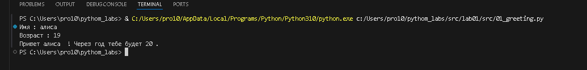

## задание 2
```bash
first = input()
sec = input()
first = float(first.replace(",","."))
sec = float(sec.replace(",","."))
print(round(first + sec,2), round((first + sec)/2,2))
```
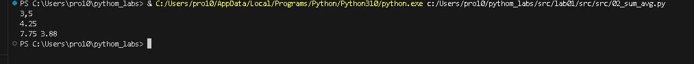

## задание 3
```bash
price = int(input())
sasale = int(input())
vshevstvennie = int(input())
base = price * (1 - sasale / 100)
hz = base * (vshevstvennie / 100)
itog = base + hz
print("База после скидки: ", base)
print("НДС: ", hz)
print("Итог к оплате: ", itog)
```
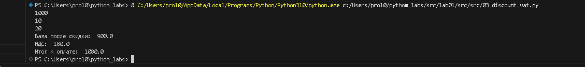

## задание 4
```bash
minets = int(input("Minuti : "))
howers = minets // 60
print(f"{howers}:{minets % 60}")
```


## задание 5
```bash
familia,ima,otchestwo = input("ФИО : ").split()
iniciala = familia[0] + ima[0] + otchestwo[0]
dlina = len(familia) + len(ima) + len(otchestwo)
print("Инициалы : ", iniciala)
print("Длина : ", dlina + 2) # два потому что у нас три слова и между ними может быть только два пробела не лишних, тк я считал  сплитом и длиной строки , то пробелы я вообще не учитывал
```
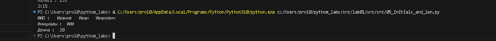


### ЛАБА 2
### задание 1.1
```bash
def pp(a):
    if a == "[]":
        return ValueError
    else:
        a = a.replace("[", "")
        a = a.replace("]", "")
        a = a.replace(",", "")
        a = a.split()
        a = list(map(float, a))
        m = min(a)
        bol = max(a)
        if str(m)[-2:] == ".0":
            m = int(str(m)[:-2])
        if str(bol)[-2:] == ".0":
            bol = int(str(bol)[:-2])
        return (m, bol)
asadasdasdas = input()
```
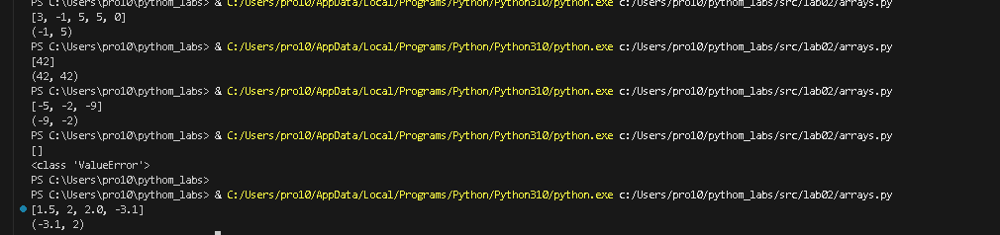


### задание 1.2
```bash
def pppp(a):
    if a == "[]":
        return a
    else:
        a = a.replace("[", "")
        a = a.replace("]", "")
        a = a.replace(",", "")
        a = a.split()
        b = []
        for i in a:
            if "." in i:
                b.append(float(i))
            else:
                b.append(int(i))
        return list(sorted(set(b)))
s = input()
print(pppp(s))
```
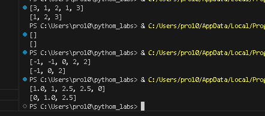

### задание 1.3
```bash
import ast
def pspsp(a):
    b = []
    for i in a:
        if i == '"':
            return TypeError
    a = ast.literal_eval(a)
    for i in a:
        for j in i:
            b.append(j)
    return b
sss = input()
print(pspsp(sss))
```
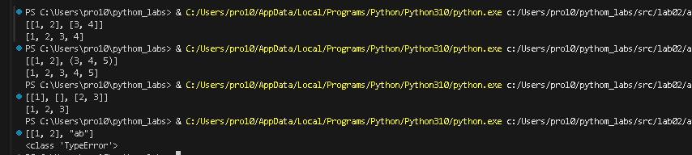

### задание 2.1
```bash
 import ast
def psiz(a):
    s = ast.literal_eval(a)
    if not s:
        return []
    for i in range(len(s) - 1):
        if len(s[i]) != len(s[i + 1]):
            return ValueError
    return [list(i) for i in zip(*s)]
aaa = input()
print(psiz(aaa))
```
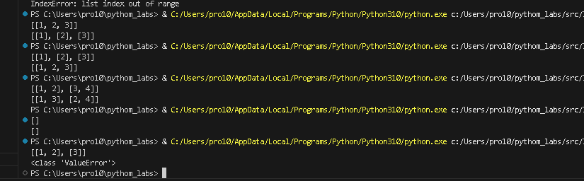

### задание 2.2
```bash
import ast
def psiz(a):
    s = ast.literal_eval(a)
    if not s:
        return []
    for i in range(len(s) - 1):
        if len(s[i]) != len(s[i + 1]):
            return ValueError
    return [sum(i) for i in s]
aaa = input()
print(psiz(aaa))
```
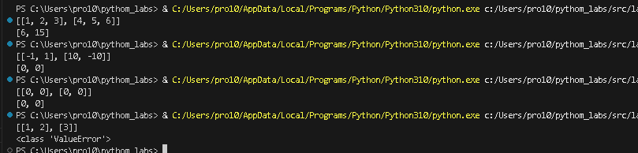

### задание 2.3
import ast
def psiz(a):
    s = ast.literal_eval(a)
    if not s:
        return []
    for i in range(len(s) - 1):
        if len(s[i]) != len(s[i + 1]):
            return ValueError
    return [sum(i) for i in zip(*s)]
aaa = input()
print(psiz(aaa))
```
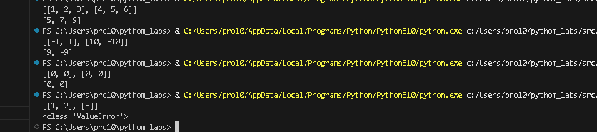
### задание 3
```bash
def format_record(rec: tuple[str, str, float]) -> str:

    fio, group, gpa = rec
    if not (isinstance(fio, str) and isinstance(group, str)) or not isinstance(gpa, (int, float)):
        return 'Неверные типы данных'
    
    parts = " ".join(fio.strip().split()).split()
    if len(parts) < 2 or not group.strip():
        return 'Некорректное ФИО или группа'
    
    surname = parts[0].capitalize()
    initials = "".join(p[0].upper() + "." for p in parts[1:3])
    
    return f'{surname} {initials}, гр. {group.strip()}, GPA {gpa:.2f}'


print(format_record(('Иванов Иван Иванович', 'BIVT-25', 4.6)))
print(format_record(('Петров Пётр', 'IKBO-12', 5.0)))
print(format_record(('Петров Пётр Петрович', 'IKBO-12', 5.0)))
print(format_record(('  сидорова  анна   сергеевна ', 'ABB-01', 3.999)))
```
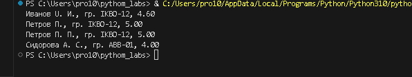


### Лаба 3
### задание 1
```bash
def normalize(text: str, *, casefold: bool = True, yoe: bool = True):
    resu = text
    contro = ['\t', '\r', '\n', '\v', '\f']
    for char in contro:
        resu = resu.replace(char, ' ')
    while '  ' in resu:
        resu = resu.replace('  ', ' ')
    resu = resu.strip()
    if yoe:
        resu = resu.replace('ё', 'е').replace('Ё', 'Е')
    if casefold:
        resu = resu.casefold()
    return resu
print(normalize("ПрИвЕт\nМИр\t"))
print(normalize("ёжик, Ёлка"))
print(normalize("Hello\r\nWorld"))
print(normalize("  двойные   пробелы  "))
```
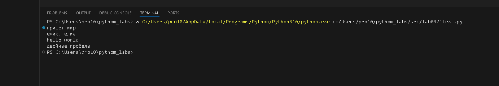

### задание 2
```bash
def tokenize(text: str):
    result = []
    current_word = []
    for i, char in enumerate(text):
        if char.isalnum() or char == '_':
            current_word.append(char)
        elif char == '-' and current_word and i + 1 < len(text) and (text[i + 1].isalnum() or text[i + 1] == '_'):
            current_word.append(char)
        else:
            if current_word:
                result.append(''.join(current_word))
                current_word = []
    if current_word:
        result.append(''.join(current_word))
    
    return result
print(tokenize("привет мир"))
print(tokenize("hello,world!!!"))
print(tokenize("по-настоящему круто"))
print(tokenize("emoji 😀 не слово"))
```
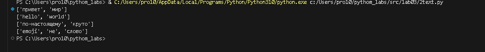

### задание 3
```bash
from collections import Counter

def count_freq(tokens: list[str]) -> dict[str, int]:
    return dict(Counter(tokens))
print(count_freq(["a","b","a","c","b","a"]))
```
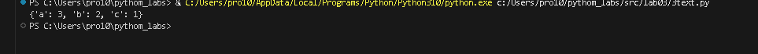

### задание 4
```bash
def top(a: list):
    prow = set(a)
    prow = sorted(a)
    schet = {}
    for i in prow:
        schet[i] = a.count(i)
    return schet
print(top(["bb", "aa", "bb", "aa", "cc" ]))
```
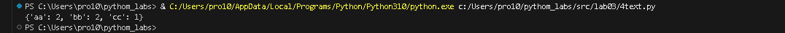

### задание 5
```bash
def normalize(text: str, *, casefold: bool = True, yoe: bool = True):
    resu = text
    contro = ['\t', '\r', '\n', '\v', '\f']
    for char in contro:
        resu = resu.replace(char, ' ')
    while '  ' in resu:
        resu = resu.replace('  ', ' ')
    resu = resu.strip()
    if yoe:
        resu = resu.replace('ё', 'е').replace('Ё', 'Е')
    if casefold:
        resu = resu.casefold()
    return resu
def tokenize(text: str):

    result = []
    current_word = []
    for i, char in enumerate(text):
        if char.isalnum() or char == '_':
            current_word.append(char)
        elif char == '-' and current_word and i + 1 < len(text) and (text[i + 1].isalnum() or text[i + 1] == '_'):
            current_word.append(char)
        else:
            if current_word:
                result.append(''.join(current_word))
                current_word = []
    if current_word:
        result.append(''.join(current_word))
    
    return result
def teststsd(sss:str):
    a = tokenize(normalize(sss))
    prow = set(a)

    prow = sorted(a)
    schet = {}
    vsego = 0
    for i in prow:
        schet[i] = a.count(i)
    for key in schet:
        vsego += schet[key]
    print("Всего слов:", vsego)
    print("Уникальных слов:", len(schet))
    print("Топ 5:")
    for i in sorted(schet.items(), reverse=True)[:5]:
        print(f"{i[0]}: {i[1]}")
teststsd("Привет, мир! Привет")
```
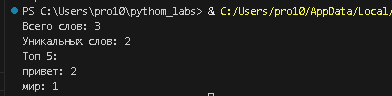

