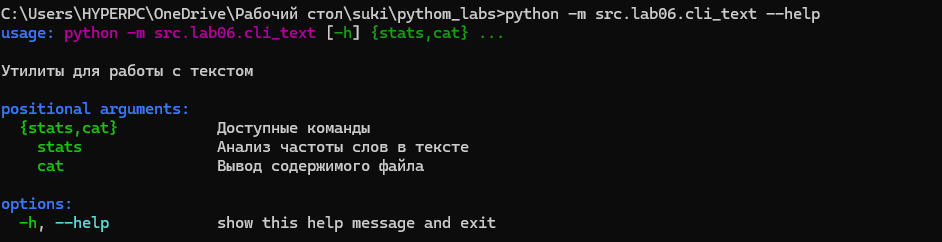
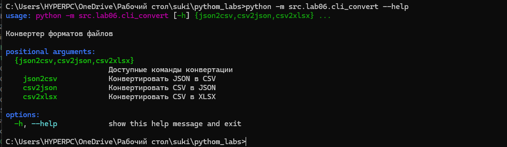
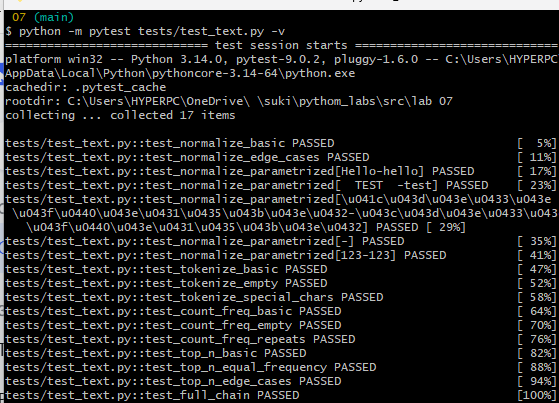
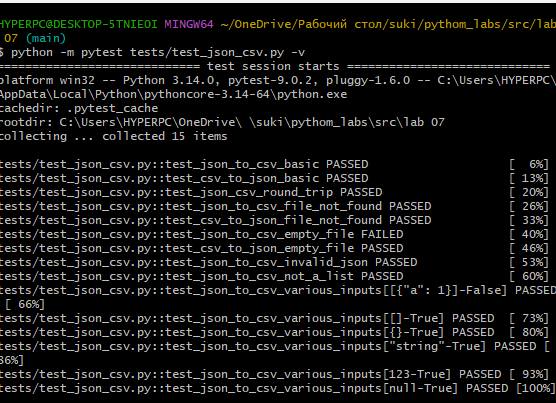
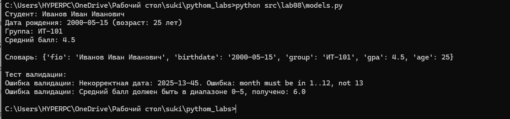
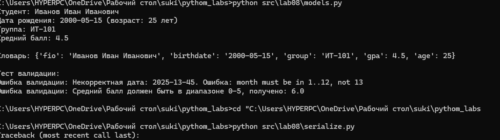
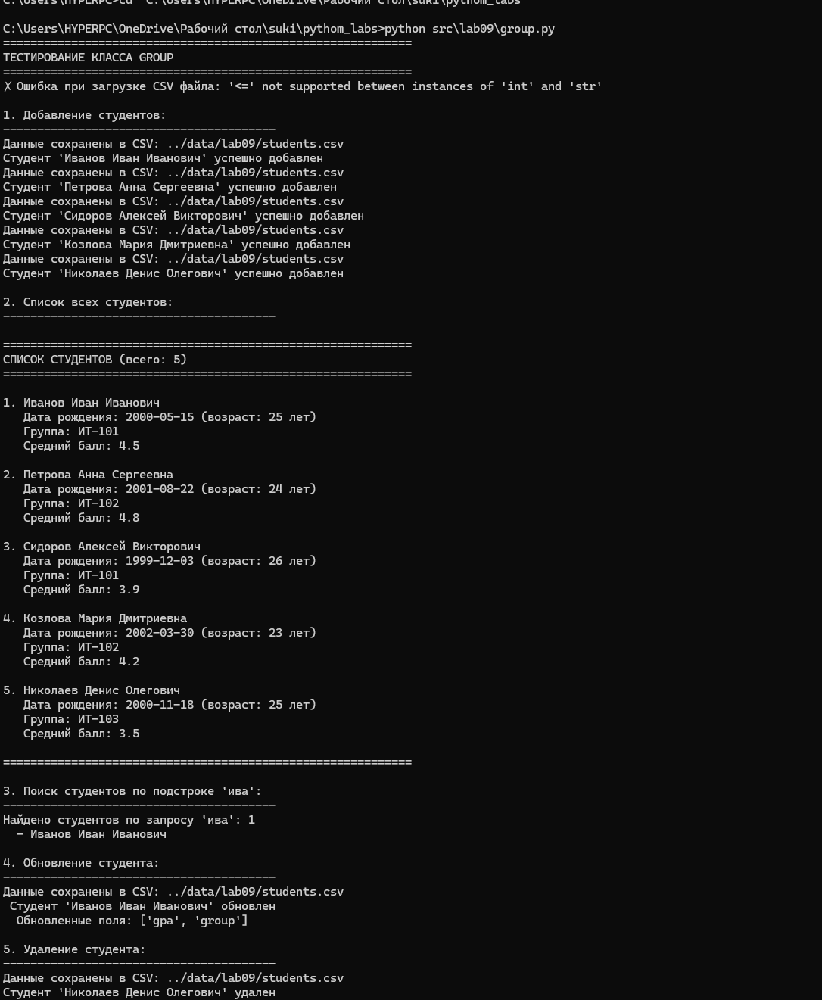
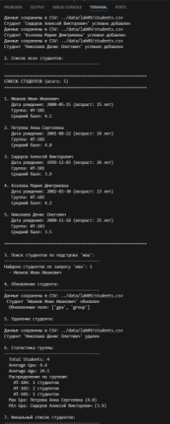
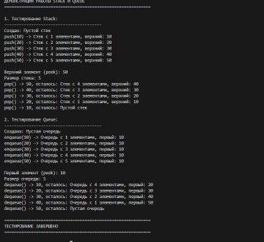

# pythom_labsgit
### лаба 1

### задание 1
```bash
name = input("Имя : ")
aage = int(input("Возраст : "))
print("Привет",name,"!", "Через год тебе будет", aage + 1, "." )
```


## задание 2
```bash
first = input()
sec = input()
first = float(first.replace(",","."))
sec = float(sec.replace(",","."))
print(round(first + sec,2), round((first + sec)/2,2))
```


## задание 3
```bash
price = int(input())
sasale = int(input())
vshevstvennie = int(input())
base = price * (1 - sasale / 100)
hz = base * (vshevstvennie / 100)
itog = base + hz
print("База после скидки: ", base)
print("НДС: ", hz)
print("Итог к оплате: ", itog)
```


## задание 4
```bash
minets = int(input("Minuti : "))
howers = minets // 60
print(f"{howers}:{minets % 60}")
```


## задание 5
```bash
familia,ima,otchestwo = input("ФИО : ").split()
iniciala = familia[0] + ima[0] + otchestwo[0]
dlina = len(familia) + len(ima) + len(otchestwo)
print("Инициалы : ", iniciala)
print("Длина : ", dlina + 2) # два потому что у нас три слова и между ними может быть только два пробела не лишних, тк я считал  сплитом и длиной строки , то пробелы я вообще не учитывал
```


### ЛАБА 2
### задание 1.1
```bash
def pp(a):
    if a == "[]":
        return ValueError
    else:
        a = a.replace("[", "")
        a = a.replace("]", "")
        a = a.replace(",", "")
        a = a.split()
        a = list(map(float, a))
        m = min(a)
        bol = max(a)
        if str(m)[-2:] == ".0":
            m = int(str(m)[:-2])
        if str(bol)[-2:] == ".0":
            bol = int(str(bol)[:-2])
        return (m, bol)
asadasdasdas = input()
```


### задание 1.2
```bash
def pppp(a):
    if a == "[]":
        return a
    else:
        a = a.replace("[", "")
        a = a.replace("]", "")
        a = a.replace(",", "")
        a = a.split()
        b = []
        for i in a:
            if "." in i:
                b.append(float(i))
            else:
                b.append(int(i))
        return list(sorted(set(b)))
s = input()
print(pppp(s))
```


### задание 1.3
```bash
import ast
def pspsp(a):
    b = []
    for i in a:
        if i == '"':
            return TypeError
    a = ast.literal_eval(a)
    for i in a:
        for j in i:
            b.append(j)
    return b
sss = input()
print(pspsp(sss))
```


### задание 2.1
```bash
 import ast
def psiz(a):
    s = ast.literal_eval(a)
    if not s:
        return []
    for i in range(len(s) - 1):
        if len(s[i]) != len(s[i + 1]):
            return ValueError
    return [list(i) for i in zip(*s)]
aaa = input()
print(psiz(aaa))
```


### задание 2.2
```bash
import ast
def psiz(a):
    s = ast.literal_eval(a)
    if not s:
        return []
    for i in range(len(s) - 1):
        if len(s[i]) != len(s[i + 1]):
            return ValueError
    return [sum(i) for i in s]
aaa = input()
print(psiz(aaa))
```

```bash
### задание 2.3
import ast
def psiz(a):
    s = ast.literal_eval(a)
    if not s:
        return []
    for i in range(len(s) - 1):
        if len(s[i]) != len(s[i + 1]):
            return ValueError
    return [sum(i) for i in zip(*s)]
aaa = input()
print(psiz(aaa))
```

### задание 3
```bash
def format_record(rec: tuple[str, str, float]) -> str:

    fio, group, gpa = rec
    if not (isinstance(fio, str) and isinstance(group, str)) or not isinstance(gpa, (int, float)):
        return 'Неверные типы данных'
    
    parts = " ".join(fio.strip().split()).split()
    if len(parts) < 2 or not group.strip():
        return 'Некорректное ФИО или группа'
    
    surname = parts[0].capitalize()
    initials = "".join(p[0].upper() + "." for p in parts[1:3])
    
    return f'{surname} {initials}, гр. {group.strip()}, GPA {gpa:.2f}'


print(format_record(('Иванов Иван Иванович', 'BIVT-25', 4.6)))
print(format_record(('Петров Пётр', 'IKBO-12', 5.0)))
print(format_record(('Петров Пётр Петрович', 'IKBO-12', 5.0)))
print(format_record(('  сидорова  анна   сергеевна ', 'ABB-01', 3.999)))
```


### Лаба 3
### задание 1
```bash
def normalize(text: str, *, casefold: bool = True, yoe: bool = True):
    resu = text
    contro = ['\t', '\r', '\n', '\v', '\f']
    for char in contro:
        resu = resu.replace(char, ' ')
    while '  ' in resu:
        resu = resu.replace('  ', ' ')
    resu = resu.strip()
    if yoe:
        resu = resu.replace('ё', 'е').replace('Ё', 'Е')
    if casefold:
        resu = resu.casefold()
    return resu
print(normalize("ПрИвЕт\nМИр\t"))
print(normalize("ёжик, Ёлка"))
print(normalize("Hello\r\nWorld"))
print(normalize("  двойные   пробелы  "))
```


### задание 2
```bash
def tokenize(text: str):
    result = []
    current_word = []
    for i, char in enumerate(text):
        if char.isalnum() or char == '_':
            current_word.append(char)
        elif char == '-' and current_word and i + 1 < len(text) and (text[i + 1].isalnum() or text[i + 1] == '_'):
            current_word.append(char)
        else:
            if current_word:
                result.append(''.join(current_word))
                current_word = []
    if current_word:
        result.append(''.join(current_word))
    
    return result
print(tokenize("привет мир"))
print(tokenize("hello,world!!!"))
print(tokenize("по-настоящему круто"))
print(tokenize("emoji 😀 не слово"))
```


### задание 3
```bash
from collections import Counter

def count_freq(tokens: list[str]) -> dict[str, int]:
    return dict(Counter(tokens))
print(count_freq(["a","b","a","c","b","a"]))
```


### задание 4
```bash
def top(a: list):
    prow = set(a)
    prow = sorted(a)
    schet = {}
    for i in prow:
        schet[i] = a.count(i)
    return schet
print(top(["bb", "aa", "bb", "aa", "cc" ]))
```


### задание 5
```bash
def normalize(text: str, *, casefold: bool = True, yoe: bool = True):
    resu = text
    contro = ['\t', '\r', '\n', '\v', '\f']
    for char in contro:
        resu = resu.replace(char, ' ')
    while '  ' in resu:
        resu = resu.replace('  ', ' ')
    resu = resu.strip()
    if yoe:
        resu = resu.replace('ё', 'е').replace('Ё', 'Е')
    if casefold:
        resu = resu.casefold()
    return resu
def tokenize(text: str):

    result = []
    current_word = []
    for i, char in enumerate(text):
        if char.isalnum() or char == '_':
            current_word.append(char)
        elif char == '-' and current_word and i + 1 < len(text) and (text[i + 1].isalnum() or text[i + 1] == '_'):
            current_word.append(char)
        else:
            if current_word:
                result.append(''.join(current_word))
                current_word = []
    if current_word:
        result.append(''.join(current_word))
    
    return result
def teststsd(sss:str):
    a = tokenize(normalize(sss))
    prow = set(a)

    prow = sorted(a)
    schet = {}
    vsego = 0
    for i in prow:
        schet[i] = a.count(i)
    for key in schet:
        vsego += schet[key]
    print("Всего слов:", vsego)
    print("Уникальных слов:", len(schet))
    print("Топ 5:")
    for i in sorted(schet.items(), reverse=True)[:5]:
        print(f"{i[0]}: {i[1]}")
teststsd("Привет, мир! Привет")
```


### ЛАБА 4
### задание 1
```bash
from pathlib import Path

def read_text(path: str | Path, encoding: str = "utf-8"):
    p = Path(path)
    
    with open(p, "r", encoding=encoding) as f:
        content = f.read()  
    return content
file_path = "a.txt"
if not Path(file_path).exists():
    with open(file_path, "w", encoding="utf-8") as f:
        f.write("Это тестовый файл a.txt\nПривет, мир!")
print(read_text(file_path))


from pathlib import Path
import csv

def write_csv(rows: list[tuple | list], path: str | Path, header: tuple[str, ...] | None = None):
    p = Path(path)
    if rows:
        first_row_length = len(rows[0])
        for i, row in enumerate(rows):
            if len(row) != first_row_length:
                raise ValueError(f"Строка {i} имеет длину {len(row)}, ожидается {first_row_length}")
            

    if header is not None and rows:
        if len(header) != len(rows[0]):
            raise ValueError(f"Заголовок имеет длину {len(header)}, а строки данных - {len(rows[0])}")
    with open(p, "w", newline="", encoding="utf-8") as f:
        writer = csv.writer(f, delimiter=",")

        if header is not None:
            writer.writerow(header)
        
        writer.writerows(rows)

# Пример использования
if __name__ == "__main__":
    data = [
        ("Иван", 25, "Москва"),
        ("Мария", 30, "СПб"),
        ("Петр", 35, "Казань")
    ]
    
    header = ("Имя", "Возраст", "Город")
    
    write_csv(data, "people.csv", header)
    print("Файл создан")
    
    # Пример с ошибкой
    try:
        invalid_data = [
            ("Анна", 28),
            ("Сергей", 32, "Москва", "лишнее")
        ]
        write_csv(invalid_data, "error.csv", header)
    except ValueError as e:
        print(f"Ошибка: {e}")
```

### задание 2
```bash
from io_txt_csv import read_text, write_csv
from pathlib import Path
import csv

def normalize(text: str, *, casefold: bool = True, yoe: bool = True):
    resu = text
    contro = ['\t', '\r', '\n', '\v', '\f']
    for char in contro:
        resu = resu.replace(char, ' ')
    while '  ' in resu:
        resu = resu.replace('  ', ' ')
    resu = resu.strip()
    if yoe:
        resu = resu.replace('ё', 'е').replace('Ё', 'Е')
    if casefold:
        resu = resu.casefold()
    return resu

def tokenize(text: str):
    result = []
    current_word = []
    for i, char in enumerate(text):
        if char.isalnum() or char == '_':
            current_word.append(char)
        elif char == '-' and current_word and i + 1 < len(text) and (text[i + 1].isalnum() or text[i + 1] == '_'):
            current_word.append(char)
        else:
            if current_word:
                result.append(''.join(current_word))
                current_word = []
    if current_word:
        result.append(''.join(current_word))
    return result

def analyze_text(file_path: str = "data/input.txt"):
    text = read_text(file_path)
    normalized_text = normalize(text)
    tokens = tokenize(normalized_text)
    word_counts = {}
    for word in tokens:
        word_counts[word] = word_counts.get(word, 0) + 1
    sorted_words = sorted(word_counts.items(), key=lambda x: (-x[1], x[0]))
    report_path = "data/report.csv"
    Path("data").mkdir(exist_ok=True)
    rows = [(word, count) for word, count in sorted_words]
    header = ("word", "count")
    
    write_csv(rows, report_path, header)
    total_words = len(tokens)
    unique_words = len(word_counts)
    
    print(f"Всего слов: {total_words}")
    print(f"Уникальных слов: {unique_words}")
    print("Топ-5:")
    for word, count in sorted_words[:5]:
        print(f"  {word}: {count}")

if __name__ == "__main__":
    file_path = "data/input.txt"
    if not Path(file_path).exists():
        Path("data").mkdir(exist_ok=True)
        with open(file_path, "w", encoding="utf-8") as f:
            f.write("Это тестовый файл input.txt\nПривет, мир! Привет всем. Тестовый-файл тестовый текст.")
    analyze_text(file_path)
```


### лаба 5

### задание 1

```bash
import json
import csv
from pathlib import Path

def json_to_csv(json_path: str, csv_path: str) -> None:
    """Простая конвертация JSON в CSV"""
    with open(json_path, 'r', encoding='utf-8') as f:
        data = json.load(f)
    
    all_keys = set()
    for item in data:
        all_keys = all_keys.union(item.keys())
    
    with open(csv_path, 'w', encoding='utf-8', newline='') as f:
        writer = csv.DictWriter(f, fieldnames=sorted(all_keys))
        writer.writeheader()
        for item in data:
            writer.writerow({key: str(item.get(key, '')) for key in all_keys})

def csv_to_json(csv_path: str, json_path: str) -> None:
    """Простая конвертация CSV в JSON"""
    with open(csv_path, 'r', encoding='utf-8') as f:
        data = list(csv.DictReader(f))
    
    with open(json_path, 'w', encoding='utf-8') as f:
        json.dump(data, f, ensure_ascii=False, indent=2)

if __name__ == "__main__":
    # Тест
    test_data = [
        {"name": "Alice", "age": 25},
        {"name": "Bob", "city": "London"}
    ]
    
    with open('test.json', 'w') as f:
        json.dump(test_data, f)
    
    json_to_csv('test.json', 'test.csv')
    print("JSON -> CSV выполнено")
    
    csv_to_json('test.csv', 'back.json')
    print("CSV -> JSON выполнено")
```


### задание 2
```bash
import csv
from openpyxl import Workbook
from openpyxl.styles import Font
from openpyxl.utils import get_column_letter


def csv_to_xlsx(csv_path: str, xlsx_path: str) -> None:
    """
    Конвертирует CSV в XLSX.
    """
    # Создаем Excel книгу и лист
    workbook = Workbook()
    sheet = workbook.active
    sheet.title = "Sheet1"
    
    with open(csv_path, 'r', encoding='utf-8') as file:
        rows = list(csv.reader(file))

    for row_num, row_data in enumerate(rows, 1):
        for col_num, value in enumerate(row_data, 1):
            sheet.cell(row=row_num, column=col_num, value=value)
    
    # Заголовки жирным
    for col in range(1, len(rows[0]) + 1):
        sheet.cell(row=1, column=col).font = Font(bold=True)
    
    for col in range(1, len(rows[0]) + 1):
        col_letter = get_column_letter(col)
        max_len = max((len(str(cell.value)) for cell in sheet[col_letter] if cell.value), default=0)
        sheet.column_dimensions[col_letter].width = max(8, max_len + 2)
    
    # Сохраняем и закрываем
    workbook.save(xlsx_path)
    workbook.close()


if __name__ == "__main__":
    # Тест
    test_data = [
        ["Имя", "Возраст", "Город"],
        ["Анна", "25", "Москва"],
        ["Иван", "30", "СПб"]
    ]
    
    with open('test.csv', 'w', encoding='utf-8', newline='') as f:
        csv.writer(f).writerows(test_data)
    
    csv_to_xlsx('test.csv', 'test.xlsx')
    print( "test.xlsx создан")
```


### лаба 6
### задание 1
```bash

import argparse
import sys
import json
import csv
from pathlib import Path

def json_to_csv(json_file, csv_file):
    """Конвертирует JSON в CSV"""
    try:
        with open(json_file, 'r', encoding='utf-8') as f:
            data = json.load(f)
        
        if not data:
            print("Ошибка: JSON файл пустой")
            return False
        if isinstance(data, list):
            headers = data[0].keys()
            
            with open(csv_file, 'w', encoding='utf-8', newline='') as f:
                writer = csv.DictWriter(f, fieldnames=headers)
                writer.writeheader()
                writer.writerows(data)
        else:
            print("Ошибка: JSON должен содержать список объектов")
            return False
            
        print(f"✓ Конвертировано: {json_file} → {csv_file}")
        return True
        
    except Exception as e:
        print(f"Ошибка при конвертации JSON в CSV: {e}")
        return False

def csv_to_json(csv_file, json_file):
    """Конвертирует CSV в JSON"""
    try:
        with open(csv_file, 'r', encoding='utf-8') as f:
            reader = csv.DictReader(f)
            data = list(reader)
        
        with open(json_file, 'w', encoding='utf-8') as f:
            json.dump(data, f, ensure_ascii=False, indent=2)
        
        print(f"✓ Конвертировано: {csv_file} → {json_file}")
        return True
        
    except Exception as e:
        print(f"Ошибка при конвертации CSV в JSON: {e}")
        return False

def csv_to_xlsx(csv_file, xlsx_file):
    """Конвертирует CSV в XLSX"""
    try:
        # Для простоты используем csv.reader и записываем как текст
        with open(csv_file, 'r', encoding='utf-8') as f:
            content = f.read()
        with open(xlsx_file, 'w', encoding='utf-8') as f:
            f.write(content)
        
        print(f"⚠ Внимание: это заглушка! Реальную конвертацию реализуйте через openpyxl")
        print(f"Файл создан: {csv_file} → {xlsx_file}")
        return True
        
    except Exception as e:
        print(f"Ошибка при конвертации CSV в XLSX: {e}")
        return False

def main():
    parser = argparse.ArgumentParser(
        description="Конвертер форматов файлов",
        prog="python -m src.lab06.cli_convert"
    )
    
    # Создаем подкоманды
    subparsers = parser.add_subparsers(
        dest="command", 
        help="Доступные команды конвертации",
        required=True
    )
    
    # 1. Команда json2csv
    json2csv_parser = subparsers.add_parser(
        "json2csv", 
        help="Конвертировать JSON в CSV"
    )
    json2csv_parser.add_argument(
        "--in", 
        dest="input_file",
        required=True,
        help="Входной JSON файл"
    )
    json2csv_parser.add_argument(
        "--out", 
        dest="output_file",
        required=True,
        help="Выходной CSV файл"
    )
    
    # 2. Команда csv2json
    csv2json_parser = subparsers.add_parser(
        "csv2json", 
        help="Конвертировать CSV в JSON"
    )
    csv2json_parser.add_argument(
        "--in", 
        dest="input_file",
        required=True,
        help="Входной CSV файл"
    )
    csv2json_parser.add_argument(
        "--out", 
        dest="output_file",
        required=True,
        help="Выходной JSON файл"
    )
    
    # 3. Команда csv2xlsx
    csv2xlsx_parser = subparsers.add_parser(
        "csv2xlsx", 
        help="Конвертировать CSV в XLSX"
    )
    csv2xlsx_parser.add_argument(
        "--in", 
        dest="input_file",
        required=True,
        help="Входной CSV файл"
    )
    csv2xlsx_parser.add_argument(
        "--out", 
        dest="output_file",
        required=True,
        help="Выходной XLSX файл"
    )
    
    # Разбираем аргументы
    args = parser.parse_args()
    
    # Выполняем команду
    if args.command == "json2csv":
        json_to_csv(args.input_file, args.output_file)
        
    elif args.command == "csv2json":
        csv_to_json(args.input_file, args.output_file)
        
    elif args.command == "csv2xlsx":
        csv_to_xlsx(args.input_file, args.output_file)

if __name__ == "__main__":
    main()


```

### задание 2

```bash
import argparse
import sys
from pathlib import Path

def analyze_text(text, top_n=5):
    """Простая функция анализа текста"""
    words = text.lower().split()
    word_count = {}
    
    for word in words:
        word = word.strip('.,!?;:"()')
        if word:
            word_count[word] = word_count.get(word, 0) + 1
    
    sorted_words = sorted(word_count.items(), key=lambda x: x[1], reverse=True)
    return sorted_words[:top_n]

def cat_file(filepath, number_lines=False):
    try:
        with open(filepath, 'r', encoding='utf-8') as f:
            for i, line in enumerate(f, 1):
                if number_lines:
                    print(f"{i:6}  {line.rstrip()}")
                else:
                    print(line.rstrip())
    except FileNotFoundError:
        print(f"Ошибка: файл {filepath} не найден")
        sys.exit(1)

def main():
    parser = argparse.ArgumentParser(
        description="Утилиты для работы с текстом",
        prog="python -m src.lab06.cli_text"
    )
    
    # Создаем подкоманды
    subparsers = parser.add_subparsers(
        dest="command", 
        help="Доступные команды",
        required=True
    )
    
    # 1. Команда stats
    stats_parser = subparsers.add_parser(
        "stats", 
        help="Анализ частоты слов в тексте"
    )
    stats_parser.add_argument(
        "--input", 
        required=True,
        help="Путь к текстовому файлу"
    )
    stats_parser.add_argument(
        "--top", 
        type=int, 
        default=5,
        help="Сколько самых частых слов показать (по умолчанию: 5)"
    )
    
    # 2. Команда cat
    cat_parser = subparsers.add_parser(
        "cat", 
        help="Вывод содержимого файла"
    )
    cat_parser.add_argument(
        "--input", 
        required=True,
        help="Путь к файлу"
    )
    cat_parser.add_argument(
        "-n", 
        action="store_true",
        help="Нумеровать строки"
    )
    
    # Разбираем аргументы
    args = parser.parse_args()
    
    # Выполняем команду
    if args.command == "stats":
        # Читаем файл
        try:
            with open(args.input, 'r', encoding='utf-8') as f:
                text = f.read()
        except FileNotFoundError:
            print(f"Ошибка: файл {args.input} не найден")
            sys.exit(1)
        
        # Анализируем
        result = analyze_text(text, args.top)
        
        # Выводим результат
        print(f"Топ-{args.top} самых частых слов в файле {args.input}:")
        print("-" * 30)
        for word, count in result:
            print(f"{word:<20} : {count:>3}")
            
    elif args.command == "cat":
        cat_file(args.input, args.n)

if __name__ == "__main__":
    main()

```


### лаба 7


### задание 1

```bash
import json
import csv
from pathlib import Path

def json_to_csv(src_path: str, dst_path: str) -> None:
    """Конвертирует JSON в CSV"""
    if not Path(src_path).exists():
        raise FileNotFoundError(f"Файл не найден: {src_path}")
    
    with open(src_path, 'r', encoding='utf-8') as f:
        data = json.load(f)
    
    if not data:
        raise ValueError("JSON файл пустой")
    
    if not isinstance(data, list):
        raise ValueError("JSON должен содержать список объектов")
    
    # Получаем заголовки из первого объекта
    headers = list(data[0].keys())
    
    with open(dst_path, 'w', encoding='utf-8', newline='') as f:
        writer = csv.DictWriter(f, fieldnames=headers)
        writer.writeheader()
        writer.writerows(data)

def csv_to_json(src_path: str, dst_path: str) -> None:
    """Конвертирует CSV в JSON"""
    if not Path(src_path).exists():
        raise FileNotFoundError(f"Файл не найден: {src_path}")
    
    with open(src_path, 'r', encoding='utf-8') as f:
        reader = csv.DictReader(f)
        data = list(reader)
    
    if not data:
        raise ValueError("CSV файл пустой")
    
    with open(dst_path, 'w', encoding='utf-8') as f:
        json.dump(data, f, ensure_ascii=False, indent=2)

``` 
```bash
def normalize(text: str) -> str:
    """Приводит текст к нижнему регистру и удаляет пробелы по краям"""
    if not text:
        return ""
    return text.lower().strip()

def tokenize(text: str) -> list[str]:
    """Разбивает текст на слова, удаляя знаки препинания"""
    if not text:
        return []
    
    words = text.split()
    result = []
    
    for word in words:
        # Убираем знаки препинания
        cleaned = word.strip('.,!?;:"()[]{}«»—')
        if cleaned:
            result.append(cleaned)
    
    return result

def count_freq(tokens: list[str]) -> dict[str, int]:
    """Считает частоту слов в списке"""
    freq = {}
    
    for token in tokens:
        freq[token] = freq.get(token, 0) + 1
    
    return freq

def top_n(freq: dict[str, int], n: int) -> list[tuple[str, int]]:
    """Возвращает N самых частых слов"""
    if not freq or n <= 0:
        return []
    
    # Сортировка: сначала по частоте (убывание), потом по слову (возрастание)
    sorted_items = sorted(freq.items(), key=lambda x: (-x[1], x[0]))
    
    return sorted_items[:n]

```

### тесты

```bash
import pytest
import json
import csv
from pathlib import Path
from json_csv import json_to_csv, csv_to_json

#  ТЕСТЫ

def test_json_to_csv_basic(tmp_path):
    """Корректная конвертация JSON → CSV"""
    json_file = tmp_path / "test.json"
    json_data = [
        {"name": "Иван", "age": 25, "city": "Москва"},
        {"name": "Мария", "age": 30, "city": "СПб"}
    ]
    json_file.write_text(json.dumps(json_data, ensure_ascii=False), encoding='utf-8')
    
    csv_file = tmp_path / "test.csv"
    json_to_csv(str(json_file), str(csv_file))
    
    assert csv_file.exists()
    
    with open(csv_file, 'r', encoding='utf-8') as f:
        reader = csv.DictReader(f)
        rows = list(reader)
    
    assert len(rows) == 2

    assert set(rows[0].keys()) == {"name", "age", "city"}

    assert rows[0]["name"] == "Иван"
    assert rows[0]["age"] == "25"  
    assert rows[1]["city"] == "СПб"

def test_csv_to_json_basic(tmp_path):
    """Корректная конвертация CSV → JSON"""
    csv_file = tmp_path / "test.csv"
    csv_content = """name,age,city
Иван,25,Москва
Мария,30,СПб"""
    csv_file.write_text(csv_content, encoding='utf-8')
    json_file = tmp_path / "test.json"
    csv_to_json(str(csv_file), str(json_file))
    assert json_file.exists()
    
    with open(json_file, 'r', encoding='utf-8') as f:
        data = json.load(f)
    assert len(data) == 2
    assert set(data[0].keys()) == {"name", "age", "city"}
    assert data[0]["name"] == "Иван"
    assert data[0]["age"] == "25" 
    assert data[1]["city"] == "СПб"
def test_json_csv_round_trip(tmp_path):
    """Тест туда-обратно: JSON → CSV → JSON"""
    original_data = [
        {"id": 1, "value": "test1"},
        {"id": 2, "value": "test2"}
    ]

    json1 = tmp_path / "original.json"
    json1.write_text(json.dumps(original_data), encoding='utf-8')
    
    csv1 = tmp_path / "converted.csv"
    json_to_csv(str(json1), str(csv1))
    
    json2 = tmp_path / "back.json"
    csv_to_json(str(csv1), str(json2))
    

    with open(json2, 'r', encoding='utf-8') as f:
        final_data = json.load(f)
    
    assert len(final_data) == len(original_data)
    assert final_data[0]["id"] == "1" 


def test_json_to_csv_file_not_found(tmp_path):
    """Файл не существует"""
    with pytest.raises(FileNotFoundError):
        json_to_csv("несуществующий.json", str(tmp_path / "output.csv"))

def test_csv_to_json_file_not_found(tmp_path):
    """Файл не существует"""
    with pytest.raises(FileNotFoundError):
        csv_to_json("несуществующий.csv", str(tmp_path / "output.json"))

def test_json_to_csv_empty_file(tmp_path):
    """Пустой JSON файл"""
    empty_file = tmp_path / "empty.json"
    empty_file.write_text("", encoding='utf-8')
    
    with pytest.raises(ValueError, match="JSON файл пустой"):
        json_to_csv(str(empty_file), str(tmp_path / "output.csv"))

def test_csv_to_json_empty_file(tmp_path):
    """Пустой CSV файл"""
    empty_file = tmp_path / "empty.csv"
    empty_file.write_text("", encoding='utf-8')
    
    with pytest.raises(ValueError, match="CSV файл пустой"):
        csv_to_json(str(empty_file), str(tmp_path / "output.json"))

def test_json_to_csv_invalid_json(tmp_path):
    """Некорректный JSON"""
    invalid_file = tmp_path / "invalid.json"
    invalid_file.write_text("{это не json}", encoding='utf-8')
    

    with pytest.raises(ValueError):
        json_to_csv(str(invalid_file), str(tmp_path / "output.csv"))

def test_json_to_csv_not_a_list(tmp_path):
    """JSON не список"""
    invalid_file = tmp_path / "not_list.json"
    invalid_file.write_text('{"name": "Иван"}', encoding='utf-8')
    
    with pytest.raises(ValueError, match="JSON должен содержать список объектов"):
        json_to_csv(str(invalid_file), str(tmp_path / "output.csv"))

@pytest.mark.parametrize("json_content, should_fail", [
    ('[{"a": 1}]', False),  # нормальный
    ('[]', True),           # пустой список
    ('{}', True),           # не список
    ('"string"', True),     # не список
    ('123', True),          # не список
    ('null', True),         # не список
])
def test_json_to_csv_various_inputs(tmp_path, json_content, should_fail):
    """Различные входные данные для JSON"""
    json_file = tmp_path / "test.json"
    json_file.write_text(json_content, encoding='utf-8')
    
    csv_file = tmp_path / "test.csv"
    
    if should_fail:
        with pytest.raises(ValueError):
            json_to_csv(str(json_file), str(csv_file))
    else:
        json_to_csv(str(json_file), str(csv_file))
        assert csv_file.exists()
```



### tests

```bash
import pytest
import json
import csv
from pathlib import Path
from json_csv import json_to_csv, csv_to_json

#  ТЕСТЫ

def test_json_to_csv_basic(tmp_path):
    """Корректная конвертация JSON → CSV"""
    json_file = tmp_path / "test.json"
    json_data = [
        {"name": "Иван", "age": 25, "city": "Москва"},
        {"name": "Мария", "age": 30, "city": "СПб"}
    ]
    json_file.write_text(json.dumps(json_data, ensure_ascii=False), encoding='utf-8')
    
    csv_file = tmp_path / "test.csv"
    json_to_csv(str(json_file), str(csv_file))
    
    assert csv_file.exists()
    
    with open(csv_file, 'r', encoding='utf-8') as f:
        reader = csv.DictReader(f)
        rows = list(reader)
    
    assert len(rows) == 2

    assert set(rows[0].keys()) == {"name", "age", "city"}

    assert rows[0]["name"] == "Иван"
    assert rows[0]["age"] == "25"  
    assert rows[1]["city"] == "СПб"

def test_csv_to_json_basic(tmp_path):
    """Корректная конвертация CSV → JSON"""
    csv_file = tmp_path / "test.csv"
    csv_content = """name,age,city
Иван,25,Москва
Мария,30,СПб"""
    csv_file.write_text(csv_content, encoding='utf-8')
    json_file = tmp_path / "test.json"
    csv_to_json(str(csv_file), str(json_file))
    assert json_file.exists()
    
    with open(json_file, 'r', encoding='utf-8') as f:
        data = json.load(f)
    assert len(data) == 2
    assert set(data[0].keys()) == {"name", "age", "city"}
    assert data[0]["name"] == "Иван"
    assert data[0]["age"] == "25" 
    assert data[1]["city"] == "СПб"
def test_json_csv_round_trip(tmp_path):
    """Тест туда-обратно: JSON → CSV → JSON"""
    original_data = [
        {"id": 1, "value": "test1"},
        {"id": 2, "value": "test2"}
    ]

    json1 = tmp_path / "original.json"
    json1.write_text(json.dumps(original_data), encoding='utf-8')
    
    csv1 = tmp_path / "converted.csv"
    json_to_csv(str(json1), str(csv1))
    
    json2 = tmp_path / "back.json"
    csv_to_json(str(csv1), str(json2))
    

    with open(json2, 'r', encoding='utf-8') as f:
        final_data = json.load(f)
    
    assert len(final_data) == len(original_data)
    assert final_data[0]["id"] == "1" 


def test_json_to_csv_file_not_found(tmp_path):
    """Файл не существует"""
    with pytest.raises(FileNotFoundError):
        json_to_csv("несуществующий.json", str(tmp_path / "output.csv"))

def test_csv_to_json_file_not_found(tmp_path):
    """Файл не существует"""
    with pytest.raises(FileNotFoundError):
        csv_to_json("несуществующий.csv", str(tmp_path / "output.json"))

def test_json_to_csv_empty_file(tmp_path):
    """Пустой JSON файл"""
    empty_file = tmp_path / "empty.json"
    empty_file.write_text("", encoding='utf-8')
    
    with pytest.raises(ValueError, match="JSON файл пустой"):
        json_to_csv(str(empty_file), str(tmp_path / "output.csv"))

def test_csv_to_json_empty_file(tmp_path):
    """Пустой CSV файл"""
    empty_file = tmp_path / "empty.csv"
    empty_file.write_text("", encoding='utf-8')
    
    with pytest.raises(ValueError, match="CSV файл пустой"):
        csv_to_json(str(empty_file), str(tmp_path / "output.json"))

def test_json_to_csv_invalid_json(tmp_path):
    """Некорректный JSON"""
    invalid_file = tmp_path / "invalid.json"
    invalid_file.write_text("{это не json}", encoding='utf-8')
    

    with pytest.raises(ValueError):
        json_to_csv(str(invalid_file), str(tmp_path / "output.csv"))

def test_json_to_csv_not_a_list(tmp_path):
    """JSON не список"""
    invalid_file = tmp_path / "not_list.json"
    invalid_file.write_text('{"name": "Иван"}', encoding='utf-8')
    
    with pytest.raises(ValueError, match="JSON должен содержать список объектов"):
        json_to_csv(str(invalid_file), str(tmp_path / "output.csv"))

@pytest.mark.parametrize("json_content, should_fail", [
    ('[{"a": 1}]', False),  # нормальный
    ('[]', True),           # пустой список
    ('{}', True),           # не список
    ('"string"', True),     # не список
    ('123', True),          # не список
    ('null', True),         # не список
])
def test_json_to_csv_various_inputs(tmp_path, json_content, should_fail):
    """Различные входные данные для JSON"""
    json_file = tmp_path / "test.json"
    json_file.write_text(json_content, encoding='utf-8')
    
    csv_file = tmp_path / "test.csv"
    
    if should_fail:
        with pytest.raises(ValueError):
            json_to_csv(str(json_file), str(csv_file))
    else:
        json_to_csv(str(json_file), str(csv_file))
        assert csv_file.exists()

```



### lab 8


### task 1

```bash
from dataclasses import dataclass, asdict
from datetime import datetime, date
import re

@dataclass
class Student:
    """Модель студента с валидацией данных"""
    fio: str           
    birthdate: str     
    group: str         
    gpa: float         
    
    def __post_init__(self):
        """Валидация данных после созданияа"""
        self._validate_birthdate()
        self._validate_gpa()
    
    def _validate_birthdate(self):
        """Проверка формата даты YYYY-MM-DD"""
        pattern = r'^\d{4}-\d{2}-\d{2}$'
        if not re.match(pattern, self.birthdate):
            raise ValueError(f"Неверный формат даты: {self.birthdate}. Используйте YYYY-MM-DD")
        
        try:
            year, month, day = map(int, self.birthdate.split('-'))
            date(year, month, day) 
        except ValueError as e:
            raise ValueError(f"Некорректная дата: {self.birthdate}. Ошибка: {e}")
    
    def _validate_gpa(self):
        if not (0 <= self.gpa <= 5):
            raise ValueError(f"Средний балл должен быть в диапазоне 0-5, получено: {self.gpa}")
    
    def age(self) -> int:
        birth_date = datetime.strptime(self.birthdate, '%Y-%m-%d').date()
        today = date.today()
        
        age = today.year - birth_date.year
        if (today.month, today.day) < (birth_date.month, birth_date.day):
            age -= 1
        
        return age
    
    def to_dict(self) -> dict:
        return {
            'fio': self.fio,
            'birthdate': self.birthdate,
            'group': self.group,
            'gpa': self.gpa,
            'age': self.age()
        }
    
    @classmethod
    def from_dict(cls, data: dict) -> 'Student':
        student_data = {key: data[key] for key in ['fio', 'birthdate', 'group', 'gpa']}
        return cls(**student_data)
    
    def __str__(self) -> str:
        return (f"Студент: {self.fio}\n"
                f"Дата рождения: {self.birthdate} (возраст: {self.age()} лет)\n"
                f"Группа: {self.group}\n"
                f"Средний балл: {self.gpa}")


if __name__ == "__main__":
    try:
        student1 = Student(
            fio="Иванов Иван Иванович",
            birthdate="2000-05-15",
            group="ИТ-101",
            gpa=4.5
        )
        
        print(student1)
        print("\nСловарь:", student1.to_dict())
        
        # Тест
        print("\nТест валидации:")
        try:
            student2 = Student(
                fio="Петров Петр",
                birthdate="2025-13-45",
                group="ИТ-102",
                gpa=4.0
            )
        except ValueError as e:
            print(f"Ошибка валидации: {e}")
            
        try:
            student3 = Student(
                fio="Сидоров Сидор",
                birthdate="2001-08-20",
                group="ИТ-103",
                gpa=6.0 
            )
        except ValueError as e:
            print(f"Ошибка валидации: {e}")
            
    except Exception as e:
        print(f"Ошибка: {e}")

```


### task 2

```bash

import json
from typing import List
from .models import Student 


def students_to_json(students: List[Student], path: str) -> None:
    """
    Сериализует список студентов в JSON файл
    
    Args:
        students: список объектов Student
        path: путь к файлу для сохранения
    """
    try:

        data = [student.to_dict() for student in students]
        
        with open(path, 'w', encoding='utf-8') as f:
            json.dump(data, f, ensure_ascii=False, indent=2, default=str)
        
        print(f" Данные сохранены в файл: {path}")
        print(f" Сохранено студентов: {len(students)}")
        
    except Exception as e:
        print(f" Ошибка при сохранении в JSON: {e}")
        raise


def students_from_json(path: str) -> List[Student]:
    try:
        with open(path, 'r', encoding='utf-8') as f:
            data = json.load(f)
        
        students = [Student.from_dict(item) for item in data]
        
        print(f" Данные загружены из файла: {path}")
        print(f" Загружено студентов: {len(students)}")
        
        return students
        
    except Exception as e:
        print(f" Ошибка при загрузке из JSON: {e}")
        raise

if __name__ == "__main__":
    try:

        students = [
            Student(
                fio="Иванов Иван Иванович",
                birthdate="2000-05-15",
                group="ИТ-101",
                gpa=4.5
            ),
            Student(
                fio="Петрова Анна Сергеевна",
                birthdate="2001-08-22",
                group="ИТ-102",
                gpa=4.8
            ),
            Student(
                fio="Сидоров Алексей Викторович",
                birthdate="1999-12-03",
                group="ИТ-103",
                gpa=3.9
            ),
            Student(
                fio="Козлова Мария Дмитриевна",
                birthdate="2002-03-30",
                group="ИТ-101",
                gpa=4.2
            ),
            Student(
                fio="Николаев Денис Олегович",
                birthdate="2000-11-18",
                group="ИТ-104",
                gpa=3.5
            )
        ]
        

        output_path = "../data/lab08/students_output.json"
        students_to_json(students, output_path)

        loaded_students = students_from_json(output_path)
        
        print("\n" + "="*50)
        print("Загруженные студенты:")
        print("="*50)
        for i, student in enumerate(loaded_students, 1):
            print(f"\nСтудент #{i}:")
            print(student)
            print("-" * 30)
            
    except Exception as e:
        print(f"Ошибка в основном блоке: {e}")


```



### lab 9 

```bash
import csv
from typing import List, Optional
import os
from datetime import datetime
import sys
sys.path.insert(0, os.path.dirname(os.path.dirname(os.path.abspath(__file__))))

from lab08.models import Student

class Group:
    """Класс для работы с группой студентов через CSV файл"""
    
    def __init__(self, csv_path: str):

        self.csv_path = csv_path
        self.students: List[Student] = []
        
        if not os.path.exists(csv_path):
            self._create_csv_file()
        

        self._load_from_csv()
    
    def _create_csv_file(self):
        """Создает пустой CSV файл с заголовками"""
        os.makedirs(os.path.dirname(self.csv_path), exist_ok=True)
        
        with open(self.csv_path, 'w', encoding='utf-8', newline='') as f:
            writer = csv.writer(f)
            writer.writerow(['fio', 'birthdate', 'group', 'gpa'])
        
        print(f" Создан новый CSV файл: {self.csv_path}")
    
    def _load_from_csv(self):
        try:
            with open(self.csv_path, 'r', encoding='utf-8') as f:
                reader = csv.DictReader(f)
                
                for row in reader:
                    try:
                        student = Student.from_dict(row)
                        self.students.append(student)
                    except ValueError as e:
                        print(f" Ошибка при загрузке студента {row.get('fio', 'unknown')}: {e}")
                
                print(f" Загружено студентов из CSV: {len(self.students)}")
                
        except Exception as e:
            print(f"✗ Ошибка при загрузке CSV файла: {e}")
            self.students = []
    
    def _save_to_csv(self):
        try:
            with open(self.csv_path, 'w', encoding='utf-8', newline='') as f:
                writer = csv.DictWriter(f, fieldnames=['fio', 'birthdate', 'group', 'gpa'])
                writer.writeheader()
                
                for student in self.students:
                    writer.writerow({
                        'fio': student.fio,
                        'birthdate': student.birthdate,
                        'group': student.group,
                        'gpa': student.gpa
                    })
            
            print(f"Данные сохранены в CSV: {self.csv_path}")
            
        except Exception as e:
            print(f"Ошибка при сохранении в CSV: {e}")
            raise
    
    def add(self, student: Student) -> bool:
        for existing_student in self.students:
            if existing_student.fio.lower() == student.fio.lower():
                print(f"Студент '{student.fio}' уже существует!")
                return False

        self.students.append(student)
        self._save_to_csv()
        
        print(f"Студент '{student.fio}' успешно добавлен")
        return True
    
    def list(self) -> List[Student]:
        return self.students
    
    def find(self, substr: str) -> List[Student]:
        substr = substr.lower()
        found_students = [
            student for student in self.students 
            if substr in student.fio.lower()
        ]
        
        print(f"Найдено студентов по запросу '{substr}': {len(found_students)}")
        return found_students
    
    def remove(self, fio: str) -> bool:
        for i, student in enumerate(self.students):
            if student.fio.lower() == fio.lower():
                removed_student = self.students.pop(i)
                self._save_to_csv()
                
                print(f"Студент '{removed_student.fio}' удален")
                return True
        
        print(f" Студент с ФИО '{fio}' не найден")
        return False
    
    def update(self, fio: str, **fields) -> bool:
        for i, student in enumerate(self.students):
            if student.fio.lower() == fio.lower():
                try:
                    student_data = {
                        'fio': student.fio,
                        'birthdate': student.birthdate,
                        'group': student.group,
                        'gpa': student.gpa
                    }
                    
                    student_data.update(fields)
                    
                    updated_student = Student.from_dict(student_data)
                    
                    self.students[i] = updated_student
                    self._save_to_csv()
                    
                    print(f" Студент '{fio}' обновлен")
                    print(f"  Обновленные поля: {list(fields.keys())}")
                    return True
                    
                except ValueError as e:
                    print(f"Ошибка при обновлении студента: {e}")
                    return False
        
        print(f" Студент с ФИО '{fio}' не найден")
        return False
    
    def get_statistics(self) -> dict:
        if not self.students:
            return {}
        total_gpa = sum(student.gpa for student in self.students)
        avg_gpa = total_gpa / len(self.students)
        
        groups = {}
        for student in self.students:
            groups[student.group] = groups.get(student.group, 0) + 1
        

        total_age = sum(student.age() for student in self.students)
        avg_age = total_age / len(self.students)
        

        max_gpa_student = max(self.students, key=lambda s: s.gpa)
        min_gpa_student = min(self.students, key=lambda s: s.gpa)
        
        return {
            'total_students': len(self.students),
            'average_gpa': round(avg_gpa, 2),
            'average_age': round(avg_age, 1),
            'groups_distribution': groups,
            'max_gpa': {
                'fio': max_gpa_student.fio,
                'gpa': max_gpa_student.gpa
            },
            'min_gpa': {
                'fio': min_gpa_student.fio,
                'gpa': min_gpa_student.gpa
            }
        }
    
    def print_all(self):
        if not self.students:
            print("В группе нет студентов")
            return
        
        print(f"\n{'='*60}")
        print(f"СПИСОК СТУДЕНТОВ (всего: {len(self.students)})")
        print(f"{'='*60}")
        
        for i, student in enumerate(self.students, 1):
            print(f"\n{i}. {student.fio}")
            print(f"   Дата рождения: {student.birthdate} (возраст: {student.age()} лет)")
            print(f"   Группа: {student.group}")
            print(f"   Средний балл: {student.gpa}")
        
        print(f"\n{'='*60}")


if __name__ == "__main__":
    print("=" * 60)
    print("ТЕСТИРОВАНИЕ КЛАССА GROUP")
    print("=" * 60)
    
    try:
        # Создаем объект Group
        csv_path = "../data/lab09/students.csv"
        group = Group(csv_path)
        
        # Тестируем добавление студентов
        print("\n1. Добавление студентов:")
        print("-" * 40)
        
        new_students = [
            Student("Иванов Иван Иванович", "2000-05-15", "ИТ-101", 4.5),
            Student("Петрова Анна Сергеевна", "2001-08-22", "ИТ-102", 4.8),
            Student("Сидоров Алексей Викторович", "1999-12-03", "ИТ-101", 3.9),
            Student("Козлова Мария Дмитриевна", "2002-03-30", "ИТ-102", 4.2),
            Student("Николаев Денис Олегович", "2000-11-18", "ИТ-103", 3.5),
        ]
        
        for student in new_students:
            group.add(student)
        print("\n2. Список всех студентов:")
        print("-" * 40)
        group.print_all()
        print("\n3. Поиск студентов по подстроке 'ива':")
        print("-" * 40)
        found = group.find("ива")
        for student in found:
            print(f"  - {student.fio}")
        print("\n4. Обновление студента:")
        print("-" * 40)
        group.update("Иванов Иван Иванович", gpa=4.7, group="ИТ-104")
    
        print("\n5. Удаление студента:")
        print("-" * 40)
        group.remove("Николаев Денис Олегович")
        

        print("\n6. Статистика группы:")
        print("-" * 40)
        stats = group.get_statistics()
        for key, value in stats.items():
            if key == 'groups_distribution':
                print(f"  Распределение по группам:")
                for group_name, count in value.items():
                    print(f"    {group_name}: {count} студентов")
            elif key in ['max_gpa', 'min_gpa']:
                print(f"  {key.replace('_', ' ').title()}: {value['fio']} ({value['gpa']})")
            else:
                print(f"  {key.replace('_', ' ').title()}: {value}")
        
        print("\n7. Финальный список студентов:")
        print("-" * 40)
        group.print_all()
        
    except Exception as e:
        print(f"\n✗ Ошибка: {e}")
        import traceback
        traceback.print_exc()
    
    print("\n" + "=" * 60)
    input("Нажмите Enter для выхода...")

```

```bash
from .group import Group

__version__ = "1.0.0"
__author__ = "Имя"
__all__ = ['Group']

print(f"Импортирован пакет lab09 версии {__version__}")
```



### lab10

### task 1
```bash
from typing import Any, Optional, Iterator


class Node:
    
    def __init__(self, value: Any, next_node: Optional['Node'] = None):
        
        self.value = value
        self.next = next_node
    
    def __repr__(self) -> str:
        """Строковое представление узла"""
        return f"Node({self.value})"


class SinglyLinkedList:
    
    def __init__(self):
        """Инициализация пустого списка"""
        self.head = None
        self.tail = None
        self._size = 0
    
    def append(self, value: Any) -> None:
        new_node = Node(value)
        
        if self.head is None: 
            self.head = new_node
            self.tail = new_node
        else:  
            self.tail.next = new_node
            self.tail = new_node
        
        self._size += 1
    
    def prepend(self, value: Any) -> None:
        new_node = Node(value, self.head)
        self.head = new_node
        
        if self.tail is None:  
            self.tail = new_node
        
        self._size += 1
    
    def insert(self, idx: int, value: Any) -> None:
        if idx < 0 or idx > self._size:
            raise IndexError(f"Индекс {idx} вне диапазона [0, {self._size}]")
        
        if idx == 0:
            self.prepend(value)
            return
        elif idx == self._size:
            self.append(value)
            return
        
        new_node = Node(value)
        current = self.head
        
        for _ in range(idx - 1):
            current = current.next
        
        new_node.next = current.next
        current.next = new_node
        self._size += 1
    
    def remove_at(self, idx: int) -> None:
        if idx < 0 or idx >= self._size:
            raise IndexError(f"Индекс {idx} вне диапазона [0, {self._size - 1}]")
        
        if idx == 0:
            self.head = self.head.next
            if self.head is None:  
                self.tail = None
        else:
            current = self.head
            for _ in range(idx - 1):
                current = current.next
        
            current.next = current.next.next

            if current.next is None:
                self.tail = current
        
        self._size -= 1
    
    def remove(self, value: Any) -> bool:
        if self.head is None:
            return False
        
        if self.head.value == value:
            self.head = self.head.next
            if self.head is None:
                self.tail = None
            self._size -= 1
            return True
        
        current = self.head
        while current.next is not None:
            if current.next.value == value:
                current.next = current.next.next
                
                if current.next is None:
                    self.tail = current
                
                self._size -= 1
                return True
            current = current.next
        
        return False
    
    def find(self, value: Any) -> Optional[int]:
        current = self.head
        idx = 0
        
        while current is not None:
            if current.value == value:
                return idx
            current = current.next
            idx += 1
        
        return None
    
    def get(self, idx: int) -> Any:

        if idx < 0 or idx >= self._size:
            raise IndexError(f"Индекс {idx} вне диапазона [0, {self._size - 1}]")
        
        current = self.head
        for _ in range(idx):
            current = current.next
        
        return current.value
    
    def __iter__(self) -> Iterator[Any]:
        current = self.head
        while current is not None:
            yield current.value
            current = current.next
    
    def __len__(self) -> int:
        return self._size
    
    def __repr__(self) -> str:
        elements = list(self)
        return f"SinglyLinkedList({elements})"
    
    def __str__(self) -> str:
        if self.head is None:
            return "Пустой список"
        
        elements = list(self)
        return f"Список с {len(self)} элементами: {elements}"


if __name__ == "__main__":
    print("=" * 60)
    print("ДЕМОНСТРАЦИЯ РАБОТЫ SINGLY LINKED LIST")
    print("=" * 60)
    
    lst = SinglyLinkedList()
    print(f"Создан: {lst}")
    
    print("\n1. Добавление элементов в конец (append):")
    print("-" * 40)
    for i in range(1, 4):
        lst.append(i * 10)
        print(f"append({i * 10}) -> {lst}")
    
    print("\n2. Добавление элементов в начало (prepend):")
    print("-" * 40)
    for i in range(3, 0, -1):
        lst.prepend(i)
        print(f"prepend({i}) -> {lst}")
    
    print("\n3. Вставка по индексу (insert):")
    print("-" * 40)
    lst.insert(2, 999)
    print(f"insert(2, 999) -> {lst}")
    
    lst.insert(0, -1)
    print(f"insert(0, -1) -> {lst}")
    
    lst.insert(len(lst), 1000)
    print(f"insert({len(lst)-1}, 1000) -> {lst}")
    
    print("\n4. Поиск элемента (find):")
    print("-" * 40)
    values_to_find = [999, 20, 777]
    for val in values_to_find:
        idx = lst.find(val)
        if idx is not None:
            print(f"Значение {val} найдено на позиции {idx}")
        else:
            print(f"Значение {val} не найдено")
    
    print("\n5. Получение элемента по индексу (get):")
    print("-" * 40)
    for i in [0, 2, len(lst) - 1]:
        print(f"get({i}) = {lst.get(i)}")
    
    print("\n6. Удаление по значению (remove):")
    print("-" * 40)
    values_to_remove = [999, 1, 777]
    for val in values_to_remove:
        if lst.remove(val):
            print(f"Удалено значение {val} -> {lst}")
        else:
            print(f"Значение {val} не найдено, список без изменений")
    
    print("\n7. Удаление по индексу (remove_at):")
    print("-" * 40)
    indices_to_remove = [0, 2, len(lst) - 1]
    for idx in indices_to_remove:
        if idx < len(lst):
            print(f"До remove_at({idx}): {lst}")
            lst.remove_at(idx)
            print(f"После remove_at({idx}): {lst}")
    
    print("\n8. Итерация по списку:")
    print("-" * 40)
    print("Элементы списка:", end=" ")
    for item in lst:
        print(item, end=" ")
    print()
    
    print("\n" + "=" * 60)
    print("ТЕСТИРОВАНИЕ ЗАВЕРШЕНО")
    print("=" * 60)
    
    input("\nНажмите Enter для выхода...")
```



### task 2

```bash
from collections import deque
from typing import Any, Optional


class Stack:
    
    def __init__(self):
        """Инициализация пустого стека"""
        self._data = []
    
    def push(self, item: Any) -> None:
        self._data.append(item)
    
    def pop(self) -> Any:
        if self.is_empty():
            raise IndexError("Нельзя выполнить pop(): стек пуст")
        return self._data.pop()
    
    def peek(self) -> Optional[Any]:
        if self.is_empty():
            return None
        return self._data[-1]
    
    def is_empty(self) -> bool:
        return len(self._data) == 0
    
    def __len__(self) -> int:
        return len(self._data)
    
    def __repr__(self) -> str:
        return f"Stack({self._data})"
    
    def __str__(self) -> str:
        if self.is_empty():
            return "Пустой стек"
        return f"Стек с {len(self)} элементами, верхний: {self.peek()}"


class Queue:
    
    def __init__(self):
        """Инициализация пустой очереди"""
        self._data = deque()
    
    def enqueue(self, item: Any) -> None:
        self._data.append(item)
    
    def dequeue(self) -> Any:
        if self.is_empty():
            raise IndexError("Нельзя выполнить dequeue(): очередь пуста")
        return self._data.popleft()
    
    def peek(self) -> Optional[Any]:
        if self.is_empty():
            return None
        return self._data[0]
    
    def is_empty(self) -> bool:
        return len(self._data) == 0
    
    def __len__(self) -> int:
        return len(self._data)
    
    def __repr__(self) -> str:
        return f"Queue({list(self._data)})"
    
    def __str__(self) -> str:
        if self.is_empty():
            return "Пустая очередь"
        return f"Очередь с {len(self)} элементами, первый: {self.peek()}"

if __name__ == "__main__":
    print("=" * 60)
    print("ДЕМОНСТРАЦИЯ РАБОТЫ STACK И QUEUE")
    print("=" * 60)
    
    print("\n1. Тестирование Stack:")
    print("-" * 40)
    
    stack = Stack()
    print(f"Создан: {stack}")
    
    for i in range(1, 6):
        stack.push(i * 10)
        print(f"push({i * 10}) -> {stack}")
    
    print(f"\nВерхний элемент (peek): {stack.peek()}")
    print(f"Размер стека: {len(stack)}")
    
    while not stack.is_empty():
        item = stack.pop()
        print(f"pop() -> {item}, осталось: {stack}")
    
    print("\n2. Тестирование Queue:")
    print("-" * 40)
    
    queue = Queue()
    print(f"Создана: {queue}")

    for i in range(1, 6):
        queue.enqueue(i * 10)
        print(f"enqueue({i * 10}) -> {queue}")
    
    print(f"\nПервый элемент (peek): {queue.peek()}")
    print(f"Размер очереди: {len(queue)}")
    
    while not queue.is_empty():
        item = queue.dequeue()
        print(f"dequeue() -> {item}, осталось: {queue}")
    
    print("\n" + "=" * 60)
    print("ТЕСТИРОВАНИЕ ЗАВЕРШЕНО")
    print("=" * 60)
    
    input("\nНажмите Enter для выхода...")
```


