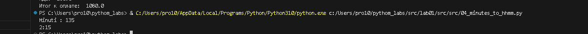

# pythom_labsgit
# лаба 1
## задание 1
```bash
name = input("Имя : ")
aage = int(input("Возраст : "))
print("Привет",name,"!", "Через год тебе будет", aage + 1, "." )
```


## задание 2
```bash
first = input()
sec = input()
first = float(first.replace(",","."))
sec = float(sec.replace(",","."))
print(round(first + sec,2), round((first + sec)/2,2))
```


## задание 3
```bash
price = int(input())
sasale = int(input())
vshevstvennie = int(input())
base = price * (1 - sasale / 100)
hz = base * (vshevstvennie / 100)
itog = base + hz
print("База после скидки: ", base)
print("НДС: ", hz)
print("Итог к оплате: ", itog)
```


## задание 4
```bash
minets = int(input("Minuti : "))
howers = minets // 60
print(f"{howers}:{minets % 60}")
```


## задание 5
```bash
familia,ima,otchestwo = input("ФИО : ").split()
iniciala = familia[0] + ima[0] + otchestwo[0]
dlina = len(familia) + len(ima) + len(otchestwo)
print("Инициалы : ", iniciala)
print("Длина : ", dlina + 2) # два потому что у нас три слова и между ними может быть только два пробела не лишних, тк я считал  сплитом и длиной строки , то пробелы я вообще не учитывал
```

